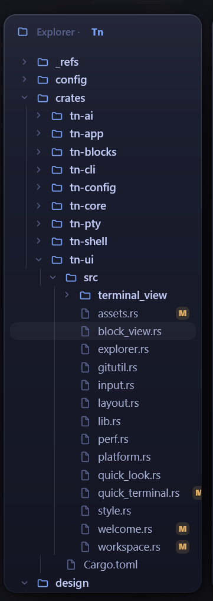

## 文件更改后，git判断缓慢，导致过了很久才反应过来才在我们的文件列表窗格中标记

## 窗格最大化以及最小化还有关闭窗格的功能失效 (已修复)

## 幽灵窗口启动器不好看（已修复）

## 窗格的背景有色带产生

## 用量判断优化，如果是API计费的话，需要在用量那里展示本次会话的费用，如果是会员的话，就展示用了百分之多少的用量

## 在终端输入数据的时候，有时候会莫名其妙的卡顿

## 整个程序响应速度不够快，内存占用太大

## git管理问题，我们被git管理的文件，虽然会有更改提示，但是他不会在文件夹这一层级显示，导致我们很多时候看不到git管理的信息。再就是文件查看窗格的显示问题，有时候我们的嵌套层级太多，会导致左右信息的截断，并且文件太多的话，由于不能滚动，我们也看不到全部的文件



---

# 修复记录 (2026-05-30)

## BUG 1: 文件更改后 git 判断缓慢

**根因：**
- `compute_git_status` 在 UI 线程同步跑 `git status --porcelain`，大仓库 / git 锁竞争时冻 UI
- 文件浏览器完全没有文件监听——git 状态只在展开/折叠目录时刷新，外部变更（git checkout、agent 改文件）不触发更新

**修复：**
1. `explorer.rs`: `compute_git_status` 改为 `gitutil::capture_bounded`（后台线程 + 1.5s 超时），`rebuild()` 不再同步算 git，改为设 `git_stale = true`，在 `render()` 里异步刷新
2. `terminal_view/mod.rs`: 新增 `FilesChanged` 事件——change watcher 检测到文件变更时发出
3. `workspace.rs`: 订阅 `FilesChanged` 事件 → `explorer.mark_stale()`；`FileSaved` 也触发刷新
4. 父目录传播：每个文件的 git tag 向上聚合到所有祖先目录，使折叠状态的文件夹也能看到标记

**涉及的 crates/files:** `tn-ui/explorer.rs`, `tn-ui/terminal_view/mod.rs`, `tn-ui/workspace.rs`

---

## BUG 1 补充修复: 父目录传播 O(n²) 优化 + 文件监听补漏

**问题 A — 缺少文件系统监听触发刷新：** `explorer.mark_stale()` 只在 `rebuild()` 和 `FileSaved` 时调用，外部文件变更不触发。change watcher 只刷新活动栏 rail，不同步刷新 explorer。

**修复 A：** 新增 `FilesChanged` 事件——`refresh_changes` 发出 → workspace 订阅 → `explorer.mark_stale()`

**问题 B — 父目录传播 O(n²)：** 每个叶子节点遍历所有祖先，每个祖先又遍历全体叶子来算最佳 tag。

**修复 B：** 改为一趟遍历——每个叶子向上走祖先链，用 `.entry().and_modify().or_insert()` 原地更新最高优先级 tag

**涉及的 crates/files:** `tn-ui/explorer.rs`, `tn-ui/terminal_view/mod.rs`, `tn-ui/workspace.rs`

---

## BUG 2: 窗格最大化/最小化/关闭功能失效

**根因：** 窗口控制按钮（Min/Max/Close）的 NC 鼠标消息被根 `track_focus` 元素拦截——`prevent_default()` 导致系统窗口命令被吞掉。与之前拖拽条被吃是同一机制。

**修复：** 给每个控制按钮加 `.occlude()`（BlockMouse），使根的点击聚焦不触发，但 `window_control_area` 仍通过 `on_hit_test_window_control` 识别（HTMINBUTTON / HTMAXBUTTON / HTCLOSE）

**涉及的 crates/files:** `tn-ui/workspace.rs`（窗口控制按钮闭包 `ctl_btn`）

---

## BUG 4: 窗格背景色带

**根因：** 大面积半透明渐变在 8-bit 显示上产生断层色带。mockup 靠 `feTurbulence` 噪点 dither + backdrop 模糊抹平，gpui 0.2.2 两样都不支持。

**状态：框架限制，暂不修复。** gpui 0.2.2 的 `linear_gradient` 只支持 2 个 color stop，多 stop 渐变编译报错。已加注释记录在 [style.rs](crates/tn-ui/src/style.rs)。

远期方案：gpui 框架升级 / 自绘 custom element 做 dither。

**涉及的 crates/files:** `tn-ui/style.rs`

---

## BUG 5: 用量判断优化（API 计费 vs 会员展示）

**修复：**
1. `tn-config`: 新增 `BillingMode` enum（`api` | `subscription`），`[general].billing_mode` 配置项，默认 `api`
2. `header.rs`: Agent 头部用量药丸根据计费模式显示不同信息：
   - **API 模式**（默认）：显示绿色 `$X.XX` 费用；费用为 $0 时回落显示 `XX%`
   - **Subscription 模式**：显示 `XX%` 上下文用量百分比

**涉及的 crates/files:** `tn-config/config.rs`, `tn-config/lib.rs`, `tn-ui/terminal_view/header.rs`, `tn-ui/terminal_view/mod.rs`

---

## BUG 5 补充修复: 用量数据显示虚假数据（❌ 首版修复方向错误，已回退订正 2026-05-30）

**真正的根因：** 首版"补充修复"基于一个**错误前提**——以为 Claude 的 `cache_creation_input_tokens` 是 `input_tokens` 的子集。**实测真实 JSONL 证伪**（`claude-opus-4-8` 的一轮）：

```
input=2   output=4379   cache_creation=29212   cache_read=47100
```

`input_tokens` 只有 **2**，cache 却高达数万 → Anthropic 的 `input_tokens` / `cache_creation_input_tokens` / `cache_read_input_tokens` 是**三个互斥、相加**的桶，`input` **不含**任何 cache。
（**Codex 恰好相反**：它的 `input_tokens` *包含* `cached_input_tokens`，所以 `codex.rs` 才需要 split——把 Codex 的语义错套到 Claude 上，正是此 bug 的来源。）

**错误修复造成的两个症状（= 用户看到的"显示不对"）：**
1. **成本天文数字 / debug panic** —— `pricing.rs` 改成 `(input - cache_create) * input_rate`。累加后 `input`（每轮个位数）远小于 `cache_create`（每轮上万）→ **u64 减法下溢**：release 下 wrap 成 ~1.8e19 → 成本显示上万亿美元；debug 下直接 panic，usage poller 后台任务挂掉、药丸不再更新。旧测试没暴露，是因为 fixture 用了不真实的 `input=300 > cache_create=10`。
2. **上下文百分比偏低** —— `claude.rs` 改成 `context_used = it + cr`，漏掉 `cc`。真实最后一轮应为 `2+29212+47100=76314`（200K 窗口 ≈ 38%），错算成 `2+47100=47102`（≈ 23.5%）。

**正确修复（回退到 HEAD `f5df16d` 的原始正确实现）：**
- `claude.rs`: `context_used = (it + cc + cr)`（三桶相加，匹配 `/context`）
- `pricing.rs`: `cost()` 不再减 cache_create——`input·in_rate + output·out_rate + cache_create·write_rate + cache_read·read_rate`（各桶各费率，纯加法，无下溢风险）
- 同步回退两处测试断言。`cargo test -p tn-ai` **15/15 通过**。

**BUG 5 主修复（API/订阅模式切换）本身正确、接线无误**：`config.general.billing_mode` → `mod.rs:360` → `TerminalView.billing_mode`（mod.rs:468）→ `header.rs:144/164`。之前"切了模式仍不对"是被成本下溢盖住了，并非接线问题。

**涉及的 crates/files:** `tn-ai/claude.rs`, `tn-ai/pricing.rs`

---

## BUG 5.2: 用量绑定错会话(刚开的空 agent 面板显示别人的高用量)2026-05-30

**现象(owner 实测两图):**
- 全新空 Claude 面板(什么都没做)显示 **156K/200K(78%)+ $108.30**;
- 全新空 Codex 面板显示 **45K/950K(5%)**、型号还是 `moonbridge`(根本不是在跑的模型)。

**根因(owner 直觉正确:绑错会话):** 用量解析从来不是"绑定本面板启动的那个会话",而是**靠目录 + 改动时间猜**——
1. **poller 传的是 `std::env::current_dir()`(Tn 自己的启动目录 `D:\coder\Tn`),不是面板里 agent 的真实 cwd**(`mod.rs:400` 旧码)。于是它在 `~/.claude/projects/D--coder-Tn/` 里找,**找到的是正在改这个仓库的 dev Claude 会话(即"我")**——文件系统实测 `a1b02a51-….jsonl` 1.29MB、mtime 22:01、上下文正好 ~156K = 屏上的数字。
2. 即便 cwd 没命中,`resolve_session` 还有**全局兜底** `latest_*_session_any()`(`detect.rs:38`)——抓**全盘最新**的那个会话,又是 dev 会话。Codex 的 `moonbridge`/45K 同理:抓到某个无关旧 rollout(unknown model → cost 0 → API 模式回落显 %,这也解释了"API 计费却显百分比")。

**死穴:** 面板启动的 claude/codex 进程 ↔ 它写的 `<uuid>.jsonl` 之间**毫无硬绑定**,纯"目录里最新的"赌;而 dogfooding(从 dev Claude 正在编辑的同一仓库里跑 Tn)是最坏情形。**且托管 agent 面板无 shell 集成 → `self.cwd()` 恒 None**,所以旧码只能退回 `env::current_dir()`(=dev 会话所在目录),cwd 路线根本救不了。

**修复(按文件创建时间绑定 + 钉死):**
- 新增 `tn_ai::resolve_session_for_pane(kind, since)`(`detect.rs`)+ `claude::newest_claude_session_created_since` / `codex::newest_codex_session_created_since`:在该 agent 的所有会话里,只取**文件创建时间 ≥ 面板启动时刻**的、最新创建的那个。**文件创建时间(`Metadata::created()`,NTFS 可靠)是唯一能把"本面板刚起的会话"和"恰好最新/正在跑的别的会话"区分开的信号**——dev 会话创建于数分钟前 → 被排除;本面板的新会话创建于启动后 → 命中。
- poller(`io.rs::spawn_usage_poller`)签名改 `(kind: AgentKind, launched_at: SystemTime)`,**丢弃 cwd**;找到后**pin 住**该文件路径,之后只跟它的 mtime,后起的更新会话永不再抢。
- `launched_at` 在 `TerminalView::new` 开头(spawn agent 之前)用 `SystemTime::now()` 捕获,保证 agent 的会话文件严格更晚;shell 内敲 `claude`/`codex` 的路径(`sync_shell_agent`)传 `now()`,`SESSION_BIND_GRACE=15s` 吸收检测延迟。
- **诚实:agent 写出第一条 assistant turn 之前,面板不显示任何用量**(`None`),不再瞎猜别人的数。
- `cargo test -p tn-ai` 15/15 通过;tn-ui `cargo check`/`build` 通过。**真机肉眼验**:新开空面板应**无用量**,实际用 claude/codex 后显示**本会话**真实数。

(「会员却显示 API/$」是另一回事 → 见下 BUG 5.3。)

**涉及的 crates/files:** `tn-ai/{detect,claude,codex,lib}.rs`, `tn-ui/terminal_view/{io,mod}.rs`, `config/config.toml`

---

## BUG 5.3: 计费模式应 per-pane,不是全局开关(Claude 会员显 API$ / Codex API 显 %)2026-05-31

**现象(owner 实测,在 5.2 修好后暴露):** 同一窗口里 Claude 是**会员**却显示 API 美元、Codex 走 **API** 却显示
百分比——两个 agent 计费方式**相反**,而 `billing_mode` 是**全局单值**,设成哪个都有一个错。
另:Codex `moonbridge` 不在价目表 → cost 恒 0 → 旧码「cost==0 就回退显 %」**让 API 面板冒充订阅**(误导根源)。

**重新设计(owner 拍板:per-pane,不要全局变量):**
- **每个面板自带 `usage_mode`**(`TerminalView` 字段,纯内存):**点击用量药丸**循环切换 `$ 费用 → % 上下文 →
  token 消耗`,**面板间互不干扰、零文件 I/O**(药丸加 `.id`/`cursor_pointer`/`hover`/`on_mouse_down`,改 `usage_mode` + `notify`)。
- **WYSIWYG**:`Api` 恒显 `$X.XX`(代理模型=`$0.00`)、`Subscription` 恒显 `%`、`Tokens` 恒显 `N tok`(`total_tokens()`)。
  **删掉骗人的「cost==0→%」回退**。
- **智能默认 `Auto`**(新增枚举值,设为默认):新面板按 agent **登录方式**自动选初始维度——
  `tn_ai::detect_subscription(kind)` 读 `~/.claude/.credentials.json` 的 `claudeAiOauth.subscriptionType`
  (实测 `"pro"` → 会员 → %)/ `~/.codex/auth.json` 的 `auth_mode`(实测 `"apikey"` → API → $)。**这一条同时修好上面两个 bug**。
- **config 作初始默认**:`[general].billing_mode`(默认 `auto`)+ 可选 `claude_billing`/`codex_billing`
  决定**起点**(`usage_display::starting_mode`,`auto` 在此解析为具体值);点击是该面板的运行时覆盖。
- 纯函数 `usage_display::{starting_mode,cycle}` headless 单测;`detect_subscription` 读认证文件、失败 → `false`(假定 API)。

**涉及的 crates/files:** `tn-config/{config,lib}.rs`, `tn-ai/{detect,lib}.rs`, `tn-ui/usage_display.rs`(新),
`tn-ui/{lib,terminal_view/mod,terminal_view/header}.rs`, `config/config.toml`

### 5.3 修正 a: 点击药丸导致窗口崩溃(`Task polled after completion` / 重入 lease)2026-05-31

**现象:** 点用量药丸 → 窗口崩(`tn.log`: `panic: Task polled after completion`)。
**根因:** 药丸点击回调原走 `pane.update(cx, |v,vcx| v.render_pane_header(vcx))`——**在 workspace render 期间**对 pane
调 `update`,而用量轮询的 `notify` 可能此刻已租借(lease)该 pane → **重入租借** → unwrap panic。
**修复:** header 渲染改 `pane.read(cx).render_pane_header(pane.downgrade())`——渲染只用共享 `read`;把 `WeakEntity`
传进药丸点击闭包,**在点击事件时**(无租借)才 `weak.update(app, …)` 改 `usage_mode`。`render_agent_header`/
`render_pane_header` 签名从 `&mut Context` 改收 `WeakEntity<Self>`;`mod.rs` render 内 `render_pane_header(cx.entity().downgrade())`。

### 5.3 修正 b: 撤销「在线查 5h 配额」试探(owner 否决)2026-05-31

调查"会员 5h 配额%"(owner 看到 68%、Tn 显 17%)时,确认 **5h/7d 配额只在 Claude Code 运行时经 stdin 喂给
statusLine 命令,不进会话日志、本地无稳定可读文件**(`.cc-session.json` 那套边车当前未启用)。曾试探加
`tn-ai/ratelimit.rs`(ureq 调 Anthropic API 读响应头)+ Cargo `ureq`/`tracing` 依赖,但 ureq 未进 workspace 根依赖
→ **全工作区编译失败**;且 owner 选择「不装 statusLine 钩子/不在线查」。**已全部撤销**:删 `ratelimit.rs`、`lib.rs`
两行 `pub mod ratelimit`/`pub use RateLimit`、`tn-ai/Cargo.toml` 的 ureq+tracing。**结论(诚实边界)**:Tn 用量只读
会话日志能算的(上下文%/等价费用$/token),**5h 会员配额无法在不改 Claude 全局配置的前提下获取**。
owner 用 config `claude_billing="api"`/`codex_billing="api"` 把两 agent 默认设为显 $(点药丸仍可切 %/token)。

### 5.3 回归: 5.2 的「按创建时间绑定」把 resume 的会话也排除了 → 两 agent 全空白(2026-05-31 实测)

**现象:** 上一版 5.2 上线后,Claude / Codex **都不显示用量**(全空)。
**根因(文件系统实测一锤定音):** 5.2 用「文件**创建**时间 ≥ 面板启动时刻」绑定,但 agent **resume/append 旧会话文件**:
今天 07:46 启动 Tn、发消息,而会话文件 `fa97b803-….jsonl`(Claude)/ `rollout-…22-26-….jsonl`(Codex)都是
**昨晚 22:25 创建**、今早 07:50 写入。创建时间远早于启动 → 被全部排除 → `None` → 空白。**创建时间无法标识
「本面板的会话」**(append 旧文件是常态)。
**修复(改按「活跃度跃迁」绑定):** `resolve_session_for_pane(kind, launched_at, baseline)` + 纯函数
`pick_pane_session`:启动时快照所有会话 mtime 作 `baseline`(`session_mtimes`);命中条件 =
**(a)** 该会话启动时不存在、或当时 stale(基线 mtime < `启动 − SESSION_ACTIVE_MARGIN(120s)`)**且 (b)**
启动后被写入(`mtime ≥ launched_at`)。→ **并发 dev 会话**(启动时就 fresh)排除、**resume 的旧会话**(stale→fresh)命中。
claude/codex 改暴露 `*_sessions_with_mtime()`(列全表交由 detect 决策);3 个 headless 时间戳单测覆盖
(resume 不抢并发 dev / 新建 / idle 不显示)。tn-ai 18 测全过,全工作区 156 测 + `TN_AUTOQUIT` 跑通。
**真机肉眼验**:发消息后用量应出现且为**本会话**真实数;另一窗口并发跑的 dev 会话不污染。

---

## BUG 6: 终端输入卡顿

**根因分析：**
- **reader 持锁太久**：缓冲区 64KB，处理大量输出时 `t.advance()` 长时间持有 terminal Mutex，UI 线程的 `on_key` 编码被阻塞
- **每键冗余重绘**：`on_key` 在底部时仍调 `scroll_to_bottom()` → `bump()` 无效化渲染缓存；`cx.notify()` 触发重绘，但此时 PTY 还没 echo，重绘的仍是旧状态

**修复：**
1. `io.rs`: reader 缓冲区 64KB → 16KB（最大持锁时间降 4 倍，UI 线程有更多间隙插入）
2. `mod.rs` `on_key`: 已处底部时跳过 `scroll_to_bottom()`（不 bump 渲染缓存）**且** 跳过 `cx.notify()`（echo 的 repaint loop 会触发正确的重绘）；仅当从历史区滚回底部时才 notify

**涉及的 crates/files:** `tn-ui/terminal_view/io.rs`, `tn-ui/terminal_view/mod.rs`

---

## BUG 7: 程序响应速度不够快 + 内存占用太大

**内存优化：**
1. **Quick Look 撤销栈** 500 → 100：每份快照是完整文件副本，500 份大文件可占 ~40MB
2. **滚动历史默认值** 10,000 → 5,000：每格 ~28B × 120 列 × 5000 行 ≈ 17MB（原 33MB）。同步更新 `tn-core`、`tn-config`、配置模板。

**响应速度：** BUG 6 的锁竞争优化（16KB 缓冲区 + 跳冗余 notify）已覆盖主要瓶颈。

**涉及的 crates/files:** `tn-ui/quick_look.rs`, `tn-config/config.rs`, `tn-core/lib.rs`, `config/config.toml`

---

## BUG 8: git 文件夹层级标记缺失 + 文件树滚动/截断

**git 文件夹层级标记：** BUG 1 的父目录传播修复已解决。`render_row` 中去掉了 `!row.is_dir` 条件，目录也显示 git tag。

**水平截断：** 文件名 div 加 `.flex_1().overflow_hidden().text_ellipsis()`，长路径用省略号截断。

**垂直滚动（重构）：** 将 explorer 的递归 div 树重构为 `uniform_list`（虚拟化列表）：
- `render_row` 方法提取为 `tree_row` 自由函数（`'static`，可被 uniform_list 闭包调用）
- 新增 `UniformListScrollHandle`，键盘 ↑↓ 导航后自动 `scroll_to_item`
- 每行等高 26px，虚拟化渲染——只渲染可见行，大目录不卡

**涉及的 crates/files:** `tn-ui/explorer.rs`（~120 行改动）
