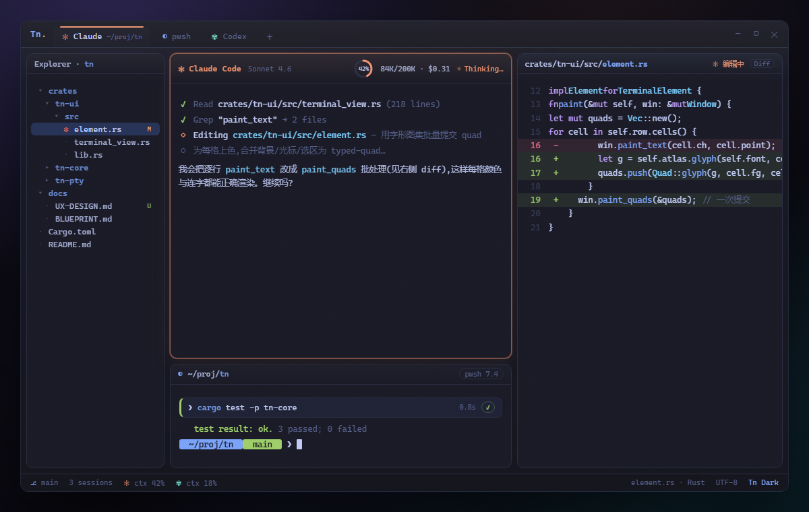

# Tn

**为 vibe coding 打造的 Windows 终端** — Rust 编写、GPU 加速,把 Claude Code / Codex 等 AI 编码 CLI 当**一等公民**托管,配 Warp 式命令块、灵活平铺,以及随叫随到的幽灵下拉终端。



> 上图为默认主题 **Tn Dark** 的高保真原型([design/mockup.html](design/mockup.html));交互式预览用浏览器打开该 HTML。

---

## Tn

**终端 ≠ shell。** PowerShell / cmd / WSL / bash 是命令解释器(从管道读写字节,自己没有窗口);**终端模拟器**才是「屏幕 + 键盘」——把这些字节流(文字 + ANSI/VT 转义码)渲染成二维网格,并把你的键盘编码回去。

Tn 做的事 = **取代 Windows 默认的 conhost**:同一套机制能跑 `powershell` / `cmd` / `wsl` / `vim`,乃至 `claude` / `codex`。PowerShell 本身不变,Tn 只是给它一个**更快、更好看、更懂 AI** 的外壳。

> 类比:**Tn 是「屏幕和键盘」,PowerShell 是「插上去的大脑」,ConPTY 是中间的「电线」。**

## 特点

- **为AI设计的终端** — 命令面板(`Ctrl+Shift+P`)一键起 Claude Code / Codex;每个 agent 窗格头部带**实时用量环**(token / 上下文占用 / 估算花费),窗口右侧提供agent改动大纲;。
- **Quick Terminal(幽灵下拉终端)** — 任意 app 里按全局热键(默认 `Ctrl+Alt+Space`)从屏幕边缘**滑下**一个置顶悬浮终端,唤出时选 Claude / Codex / pwsh,**失焦自动隐藏**,会话保留;退出当前 agent 即回到选择器。不打断手头工作就能召唤 AI。
- **Warp 式命令块** — 把每条命令聚成一个**块**:状态条(成功/失败/运行中)、退出码、时长、cwd;
- **多AI合作完成项目** 通过实现独特的分屏逻辑，能够让多个AI在同一个屏幕内公用一个项目，不需要复杂的配置，如果你对某一窗口布局满意，可以在左上角的布局选项中一键保存布局。
- **文件浏览器 + 文件/Diff 查看器** — 侧栏文件树(git M/U/A 标记)：实现现代化的文件浏览器，不需要再专门装其他的文件浏览工具，同时提供文件预览功能，点击文件，按空格就能实现快速预览，上下方向键位快速切换文件，如果有git仓库的存在，会即时显示更改。
- **WSL + 远程 Linux(SSH)** — 规划中(M2)：支持链接wsl与ssh。

## 快速开始

**方式一:下载预构建包(无需 Rust)**

1. 从 [GitHub Releases](https://github.com/42588/Tn/releases) 下载最新 `tn.zip`
2. 解压,右键 `install.ps1` → 使用 PowerShell 运行
3. 完成后 `Win+R` 输入 `tn` 回车

**方式二:从源码构建(需要 Rust 环境)**

环境:**Rust**(stable `x86_64-pc-windows-msvc`)+ **VS C++ 生成工具** + **Windows SDK**(GPUI / DirectX 必需)。

```powershell
# 安装(构建 + 复制到 %LOCALAPPDATA%\Programs\Tn\ + 加入 PATH + 快捷方式)
powershell -File scripts\install.ps1

# 安装后任意终端直接启动
tn
```

开发时直接跑(不安装):

```powershell
cargo run -p tn-app          # 开终端窗口
```

无窗口的 headless 检查:

```powershell
cargo test  --workspace                      # 单元测试(共 162)
cargo run   -p tn-cli                         # ConPTY 烟雾测试(起 shell、把网格渲染到 stdout)
$env:TN_AUTOQUIT="1"; cargo run -p tn-app     # GUI 自测:跑命令、dump 网格、退出
```

## 快捷键

| 快捷键                          | 动作                                        |
| ------------------------------- | ------------------------------------------- |
| `Ctrl+Alt+Space`                | 唤出 / 隐藏 **Quick Terminal**(全局热键)    |
| `Ctrl+Shift+P`                  | **命令面板**(一键起 Claude / Codex / shell) |
| `Ctrl+Shift+T`                  | 新标签                                      |
| `Ctrl+Shift+N`                  | 新会话（分屏）                              |
| `Ctrl+Shift+W`                  | 关闭窗格                                    |
| `Ctrl+Shift+]` / `Ctrl+Tab`     | 下一个窗格 / 下一个标签                     |
| `Ctrl+Shift+方向键`             | 改分屏尺寸                                  |
| `Ctrl+Shift+B` / `Ctrl+Shift+J` | 文件浏览器 / 文件·Diff 查看器               |
| `Ctrl+Shift+C` / `Ctrl+Shift+V` | 复制 / 粘贴                                 |
| `Ctrl+Shift+R`                  | 热重载配置                                  |

> ⚠️ 中文 / 多布局 Windows 上,系统「切换键盘布局」热键也是 `Ctrl+Shift`,可能在按键到达 app 前吞掉 `Ctrl+Shift+*` 快捷键。可在配置里改键,或在 _设置 → 时间和语言 → 输入 → 高级键盘设置 → 输入语言热键_ 里把布局切换设为「未分配」。`Ctrl+Alt+Space`(Quick Terminal)是系统级注册热键,不受影响。

## 配置

首次运行写到 `%APPDATA%\Tn\`:

- `config.toml` — `[general]` / `[font]` / `[appearance]` / `[quick_terminal]` + `[[profiles]]`(会话启动器条目)/ `[[keybindings]]`,字段全可省略(缺省回退内置默认)。
- `themes\tn-dark.toml` — 主题。

改完重启生效;颜色可 `Ctrl+Shift+R` 热重载。

## 工作区(crates)

```
tn-core    终端引擎:alacritty 包装(VT 解析 + 网格 + 快照 + 调色板)        — headless
tn-pty     PTY 后端:ConPTY(WSL/SSH = M2)                                — headless
tn-config  配置 + 主题 + Quick Terminal schema/几何/热键解析               — headless
tn-shell   shell 集成:OSC 133/633/7 旁路解析 → BlockEvent + 集成脚本       — headless
tn-blocks  Warp 式命令块状态机(命令/输出/退出码/时长)                     — headless
tn-ai      Claude/Codex 本地会话用量解析 + agent 检测                       — headless
tn-ui      GPUI 前端(唯一链接 gpui 的库):终端视图 / 分屏 / 命令面板 / Quick Terminal / 查看器
tn-app     二进制 `tn`:开窗 + 接线 + 崩溃保护 + 文件日志
tn-cli     headless ConPTY 烟雾测试工具
```

## 文档

职责分层(**架构 · 产品体验 · 样式实现**)+ 参考:

- [docs/系统架构索引.md](docs/系统架构索引.md) — **架构**:系统怎么搭(crate 划分、数据流、技术决策、路线图、开发指南)。
- [docs/产品体验索引.md](docs/产品体验索引.md) — **产品体验**:用户可见 UX、交互原则、页面/面板入口。
- [docs/界面样式实现规则.md](docs/界面样式实现规则.md) — **样式实现**:HTML 原型 → gpui 的入口规则;译法与权威数值表见 `docs/界面样式/`。
- [docs/外部参考资料索引.md](docs/外部参考资料索引.md) — 从 Windows Terminal 与 Ghostty 源码提炼、映射到 Tn 的设计要点。
- [CHANGELOG.md](CHANGELOG.md) — 各里程碑变更。
- 设计原型:[design/mockup.html](design/mockup.html)(全窗)· [design/panels/](design/panels/)(逐面板,共享 calm-glass.css)。

## 许可证

**GPL-3.0-or-later**。规避了 GPUI 依赖树里 GPL-3.0 传递依赖的许可证冲突([zed#55470](https://github.com/zed-industries/zed/issues/55470))。
