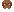

# 宠物系统索引

## 定位

本文是 Tn 宠物系统的入口索引。宠物系统是终端里的通用趣味功能,核心目标是让长期使用终端时更有陪伴感和轻松感。宠物不是静止贴图,可以低干扰感知终端输入、命令运行、退出结果和鼠标互动,但不替代正式的错误提示、权限提示或 agent 状态提示。

## 入口索引

| 主题 | 文件 | 用途 |
|---|---|---|
| 宠物系统规则 | [宠物系统规则](宠物系统规则.md) | 定义通用显示原则、终端上下文感知、鼠标互动、生命周期、可关闭能力和实现边界 |
| 小狗家族设计 | [小狗家族设计](小狗家族设计.md) | 记录 7 个小狗品种原型的视觉特征、性格方向和后续扩展规则 |
| 西高地 | [01-westie.svg](原型/01-westie.svg) | 白色尖耳、短腿、精神的小型小狗 |
| 金毛 | [02-golden-retriever.svg](原型/02-golden-retriever.svg) | 暖金色、垂耳、温和的大型小狗 |
| 德牧 | [03-german-shepherd.svg](原型/03-german-shepherd.svg) | 立耳、黑背、警觉的工作犬轮廓 |
| 比熊 | [04-bichon-frise.svg](原型/04-bichon-frise.svg) | 白色圆蓬毛、棉花团轮廓 |
| 马尔济斯 | [05-maltese.svg](原型/05-maltese.svg) | 白色长毛、中分毛束、小蝴蝶结 |
| 西施 | [06-shih-tzu.svg](原型/06-shih-tzu.svg) | 白金双色脸、短鼻、头顶毛束 |
| 泰迪 | [07-toy-poodle.svg](原型/07-toy-poodle.svg) | 棕色卷毛、圆耳、玩具感 |

## 原型预览

| 品种 | 原型 |
|---|---|
| 西高地 |  |
| 金毛 |  |
| 德牧 |  |
| 比熊 |  |
| 马尔济斯 |  |
| 西施 |  |
| 泰迪 |  |

## 使用边界

- 宠物是通用趣味层,可以感知终端上下文并做像素演出,但不能成为正式状态提示的唯一载体。
- 宠物必须能关闭;用户固定选择品种时优先使用用户配置,未固定时由终端初始化随机决定。
- 宠物不抢焦点、不遮挡输入、不进入终端文本流、不影响复制。
- 宠物种类在单个终端生命周期内保持稳定,直到该终端进程彻底结束。

## 反向链接

- [小狗宠物家族重做任务](../任务/2026-06-10-小狗宠物家族重做.md)
- [原始宠物系统任务](../任务/2026-06-10-Tn宠物系统原型设计.md)
- [宠物上下文感知规则更新任务](../任务/2026-06-10-宠物上下文感知规则更新.md)
